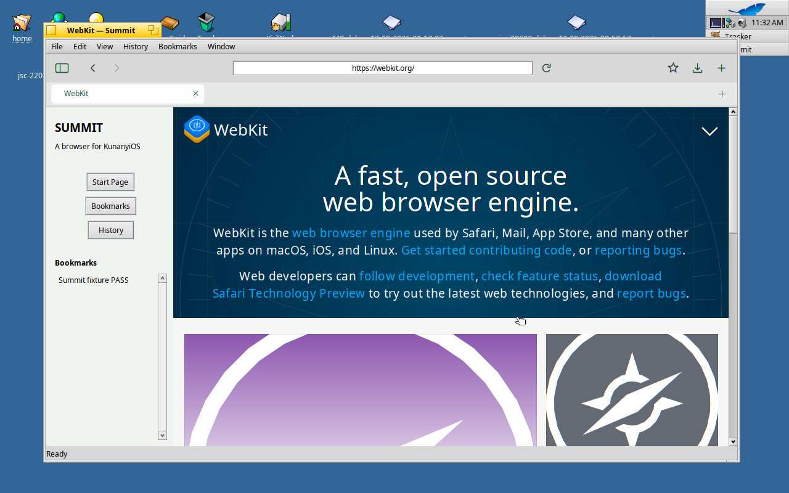

# Summit

A native browser for KunanyiOS and Haiku, with a Safari-inspired layout.

**Development preview — the complete browser is still under construction.**
The native app builds and runs in Haiku R1/beta6 x86_64. It has real WebKit
pages, tabs, back/forward navigation, address/search input, page find and zoom,
bookmarks, history, downloads and saved sessions. The **latest upstream WebKit**
port pinned on September 13 now builds and runs in Summit, with 37 native browser
checks passing. Extension execution is not implemented yet.



## Build and try

The current-engine development bundle is `artifacts/current-browser/`. Copy that
whole directory to Haiku R1/beta6 x86_64 and run its `Summit` executable. Its
private WebKit libraries, source archive and build manifest accompany the app.

For fast UI development using Haiku's installed WebKit SDK:

```sh
pkgman install gcc make haikuwebkit_devel
make -j6
make check
./build-haiku/Summit
```

The app uses native Interface Kit controls. Haiku's default Command modifier
is **Alt**: Alt+L focuses the address field; Alt+T creates a tab; Alt+W closes
it; Alt+Shift+T reopens the last closed tab; Alt+D bookmarks the page; Alt+F
finds text; Alt+R reloads. Ctrl+Tab cycles tabs. The search provider is currently
DuckDuckGo. Explicit `http://`, `https://` and `file://` addresses are supported.

Profiles live in `~/config/settings/Summit/`. `--profile /path` selects a separate
directory for browser state. Cookies use a SQLite file in that directory.
Complete separation of all engine storage requires further verification.
Downloads are saved in `~/Downloads/`; the toolbar button opens that folder.

The earlier system-engine preview package is
`artifacts/summit-0.1.0~dev1-1-x86_64.hpkg` when built:

```sh
pkgman install ./artifacts/summit-0.1.0~dev1-1-x86_64.hpkg
/boot/system/apps/Summit
```

## Development

The portable tests run on Linux as well as Haiku:

```sh
cmake -S . -B build-host -DCMAKE_BUILD_TYPE=Debug
cmake --build build-host -j6
ctest --test-dir build-host --output-on-failure
```

The independent [QEMU environment](docs/VM.md) supplies the native SDK and
renderer. `bash tools/build-in-vm.sh` builds there and copies the executable
to `artifacts/`. For live browser verification, start
`python3 tools/serve-fixtures.py` on the host, launch Summit in the VM, then run
`make browser-smoke` inside `/boot/home/summit` in the guest.

`bash tools/build-current-browser-in-vm.sh` builds the pinned engine, compiles
Summit against it, and creates a bundle with private libraries. The bundle's
library paths were verified against the native loader. It includes the patched
WebKit source used for the build. `bash tools/copy-current-browser-bundle.sh`
can repeat the host copy without rebuilding when the engine inputs still match.

See [the current verification record](docs/STATUS.md), the complete
[requirements and remaining work](docs/REQUIREMENTS.md), and the
[engine source and porting notes](engine/README.md). Passing the preview's
tests does not establish full web-platform or extension compatibility.

Summit's application code is MIT-licensed. WebKit and the Haiku port retain
their upstream per-file licenses; engine source changes are in `engine/patches`.
The JSON dependency is unmodified nlohmann/json 3.12.0 under MIT.
