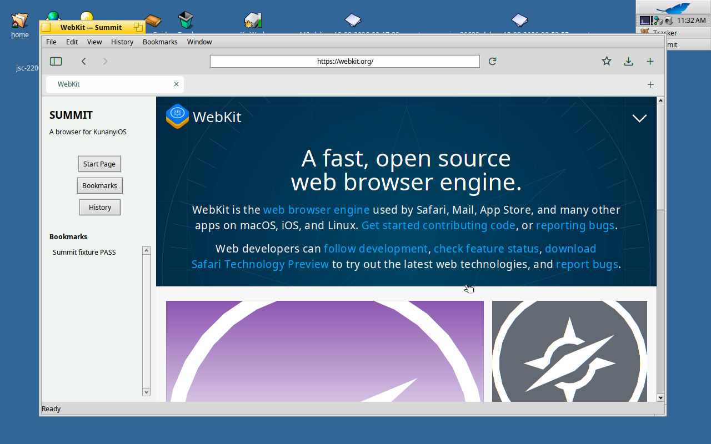

# Summit


Summit is a native WebKit browser for **air/OS and Haiku**, with native controls,
a compact toolbar, and a multiprocess engine.

**Development preview.** Summit is used and tested on air/OS; web-platform and
extension compatibility are still evolving. Feature notes below describe the
current source. Download packages identify the commit they were built from.

[Download the latest release](https://github.com/jmgasper/summit/releases/tag/latest)
— choose the Summit and Summit WebKit packages for your architecture from the
build table below.



<!-- airos-ci:latest-builds:start -->
## Latest builds

Built automatically by air/OS CI from commit `03e9cc3` on 2026-10-07 ([all files](https://github.com/jmgasper/summit/releases/tag/latest)).

| Architecture | Package |
|---|---|
| arm64 | [summit-0.1.0.git20261007.2007-1-arm64.hpkg](https://github.com/jmgasper/summit/releases/download/latest/summit-0.1.0.git20261007.2007-1-arm64.hpkg) |
| arm64 | [summit_webkit-1.10.1.git20261007.2007-1-arm64.hpkg](https://github.com/jmgasper/summit/releases/download/latest/summit_webkit-1.10.1.git20261007.2007-1-arm64.hpkg) |
| x86_64 | [summit-0.1.0.git20261007.2007-1-x86_64.hpkg](https://github.com/jmgasper/summit/releases/download/latest/summit-0.1.0.git20261007.2007-1-x86_64.hpkg) |
| x86_64 | [summit_webkit-1.10.1.git20261007.2007-1-x86_64.hpkg](https://github.com/jmgasper/summit/releases/download/latest/summit_webkit-1.10.1.git20261007.2007-1-x86_64.hpkg) |

Install with `pkgman install <file>`, or copy the file into `/boot/system/packages`. Haiku SDK: x86_64 hrev60206-735-ge1fddb8f6c, arm64 hrev60206-735-ge1fddb8f6c.
<!-- airos-ci:latest-builds:end -->

## Browser features

- Tabs, saved sessions, back/forward history, bookmarks, downloads, page find,
  configurable search, and per-site zoom.
- [Private windows and browsing-data controls](docs/browser-privacy.md),
  [certificate warnings and connection details](docs/certificate-warnings.md),
  and native website permission prompts.
- [Reader mode](docs/reader-mode.md) for articles, with a book button in the
  address field, sanitized content, and the original page's URL retained in history.
- A bundled [PDF viewer](docs/pdf-viewer.md) with navigation, search, zoom,
  password entry, and downloads of the original document.
- Native [color, date, month, week, time, and local date/time pickers](docs/native-form-pickers.md).
- [Developer tools](docs/developer-tools.md) for page inspection, JavaScript
  console output, and network requests.
- [Extension installation from Chrome Web Store and Firefox Add-ons](docs/extension-stores.md),
  native permission review, toolbar actions and popups, and restoration of
  approved extensions across restarts. Local CRX3, ZIP/XPI, and folder packages
  are also supported.

Published uBlock Origin and Dark Reader have passed native runtime suites;
1Password has verified sign-in, inline filling, and
[Web Authentication/passkey integration](docs/webauthn-passkeys.md). This is
not a promise that every Chrome, Firefox, or Safari extension works. See the
[verification record](docs/STATUS.md) and [1Password notes](docs/webextensions-1password.md)
for tested versions and limitations.

## Web features

| Area | Current implementation |
| --- | --- |
| Rendering | Modern WebKit HTML/CSS/JavaScript, [WebGL](docs/webgl.md), and accelerated compositing when a suitable EGL/GLES driver is available; software rendering otherwise. |
| Canvas | Main-thread and worker OffscreenCanvas with 2D, WebGL/WebGL2, and ImageBitmap transfer. |
| Images | Standard web formats plus JPEG XL and HEIC decoding, and JPEG XR decoding/encoding. |
| Media | HTML audio/video, MediaSource, and direct [MPEG-DASH](docs/dash-playback.md) for H.264/AAC, with seeking, adaptive quality, and live-manifest refresh. |
| Encrypted media | [Clear Key EME](docs/encrypted-media.md) with temporary CENC sessions for H.264/AAC through MediaSource or DASH. Widevine, PlayReady, FairPlay, and persistent licenses are unsupported. |
| Devices | [WebUSB](docs/web-platform-issues.md) and [Web Bluetooth](docs/bluetooth-transport.md), with native selection, origin-scoped grants, protected-device checks, and cancellation on page closure. |
| Integration | Native fullscreen, approved external-app and website protocol handlers, and Web Authentication. |

[Web-platform notes](docs/web-platform-issues.md) document the supported subsets.
Device access requires a secure context and user approval. WebUSB physical
transfers and successful physical Bluetooth GATT reads still need dedicated
device validation; the Bluetooth busy-controller check passed while preserving
X399's active mouse link. Bluetooth currently supports the top-level origin and
same-origin children, session-only grants, and the air/OS stack's existing LE
connection facilities. New pairing and advertisement observation APIs are not
implemented.

## Build and run

Use matching application and engine packages from the release table. Native
engine builds need the air/OS/Haiku toolchain and private dependencies described
in the [engine notes](engine/README.md).

The full multiprocess, extension-enabled development build is:

```sh
bash tools/build-webkit-in-vm.sh --modern-extensions all
bash tools/build-modern-browser-in-vm.sh --browser --bundle --modern-extensions
```

The scripts record the resulting bundle path. Copy the entire bundle and run
its `run-browser.sh`; it carries the matching engine, process helpers, private
libraries, source archive, and build manifest. See
[bundle instructions](docs/modern-bundle-copy.md) and the [native test VM](docs/VM.md).

For UI development against an installed Haiku WebKit SDK:

```sh
pkgman install gcc make haikuwebkit_devel
make -j6
make check
./build-haiku/Summit
```

That SDK may expose fewer features than Summit's patched engine.

Portable tests also run on Linux. Install a C++ compiler, CMake, and OpenSSL
development headers/libraries, then run:

```sh
cmake -S . -B build-host -DCMAKE_BUILD_TYPE=Debug
cmake --build build-host -j6
ctest --test-dir build-host --output-on-failure
```

## Using Summit

Haiku's default Command modifier is **Alt**: Alt+L focuses the address field,
Alt+T opens a tab, Alt+W closes it, Alt+Shift+T reopens the last closed tab,
Alt+D bookmarks the page, Alt+F finds text, and Alt+R reloads. Ctrl+Tab cycles
tabs. Choose the search provider in Preferences.

Profiles live in `~/config/settings/Summit/`; `--profile /path` selects a
separate profile. Downloads default to `~/Downloads/`.
[Privacy notes](docs/browser-privacy.md) describe storage and private windows.

The application icon is the native vector resource `resources/Summit.hvif`.
Editable toolbar artwork, generated image sizes, and regeneration commands
are documented in [resources/artwork](resources/artwork/README.md).

See [current verification](docs/STATUS.md),
[the October issue work](docs/issue-fixes-2026-10-07.md),
[requirements and remaining work](docs/REQUIREMENTS.md), and
[performance measurements](docs/performance.md) for implementation evidence.

Summit's application code is MIT-licensed. WebKit and the Haiku port retain
their upstream per-file licenses; engine changes are in `engine/patches`.
Bundled dependencies retain their own licenses and notices.
