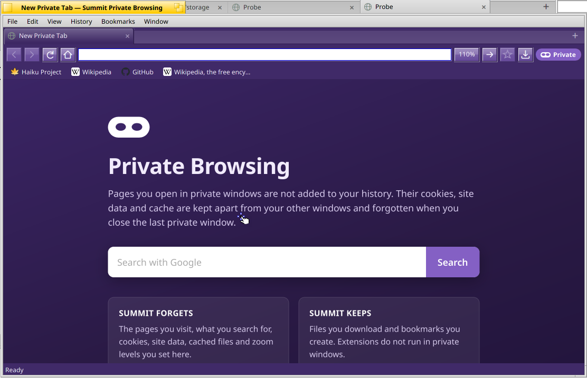

# Private windows, zoom, search engines and clearing data

Added 28 September 2026, on top of [browser-ui.md](browser-ui.md) and
[browser-windows.md](browser-windows.md).

## What the user sees

### Private windows

- **File › New Private Window** (Shift+Alt+N) opens a window drawn in purple:
  its tabs, toolbar, buttons, bookmarks bar and status line, in both the Haiku
  and the Safari-like look. A **Private** badge (a white mask) ends the
  toolbar, the title reads "… — Summit Private Browsing" (so does the Deskbar)
  and the Window menu adds "(Private)".
- New tabs show a private start page: what Summit forgets and keeps, and a
  search field for the chosen search engine. Home still goes to the home page.
- Every private window shares one private session, as in other browsers. Its
  cookies, cache, local storage, IndexedDB and service workers live only in
  memory, apart from normal windows (neither can see the other's cookies).
  When the last private window closes, all of it is gone; the next private
  window starts empty.
- Private windows record no history (nor history title updates), are never
  reopened with the session, and store no site icons on disk (they show icons
  already known and keep new ones in memory). Recently closed tabs stay in
  that window.
- Zoom levels chosen in a private window last for the private session only;
  saved levels from normal windows still apply there, as in Firefox.
- Links: the page context menu offers **Open Link in New Private Window**; in
  a private window, "new window" links, pop-ups and Move Tab to New Window stay
  private. File › New Window always opens a normal window.
- Extensions do not run in private windows. Their tab and window requests, and
  pages opened from outside Summit (command line, Tracker), go to the front
  normal window, or open one.
- Downloads and bookmarks made in a private window are kept.

### Zoom

- View › Zoom In (Alt++ or Alt+=), Zoom Out (Alt+-), Actual Size (Alt+0), and
  **Alt with the mouse wheel** over the page (up zooms in). Steps are
  Firefox's: 30, 50, 67, 80, 90, 100, 110, 120, 133, 150, 170, 200, 240, 300,
  400 and 500%.
- While a page is not at 100% its zoom shows in the toolbar, after the address
  field (a pill in the Safari-like look). Clicking it resets the page to 100%.
- Zoom is remembered per site (host without "www.", with its port; one entry
  for local files), in `profile.json` as `siteZoom`. A site opens at its zoom
  in new tabs and after a restart; changing it changes every tab of that site
  in every window; a page on another site returns to that site's zoom.

### Search engine

Edit › Preferences… › General › Search engine: **DuckDuckGo** (default),
**Google** or **Bing**. Text typed in the address field that is not an
address, the private start page's search field and the context menu's
"Search *Engine* for "…"" (which now always searches, even for text that looks
like an address) use it. Saved as `searchEngine` in `profile.json`.

### History and Data (Preferences)

- **History: N pages — Clear History…** asks, then forgets every visited page,
  the History page file written from them, recently closed tabs in every
  window, and the icons of sites that are not bookmarked. (History › Clear
  History… does the same.)
- **Cache: size — Clear Cache** removes WebKit's disk and memory caches at
  once. The size is measured from `<profile>/WebKit/Cache` on a separate thread.
- **Cookies and site data — Clear Cookies and Site Data…** asks, then removes
  cookies, local and session storage, IndexedDB, service worker registrations
  and their caches. It signs you out of websites. **Extensions keep their own
  data**: storage under `webkit-extension:` origins (for example 1Password's
  vault in IndexedDB) is not touched.

## How it works

- `src/main.cpp` creates the private `BWebKitContext` (non-persistent website
  data store, its own process pool) when the first private window opens, gives
  it the download listener, and releases it when the last private window
  closes — after cancelling any of its downloads still running
  (`fRetiredPrivateContexts`). Windows are routed by kind: `FrontNormalWindow()`
  receives command-line pages, Tracker drops and extension commands.
- `BrowserWindow` takes `BrowserWindowOptions::privateBrowsing`; `fPrivate`
  skips `Profile::Visit`, history titles, `SaveSession` and on-disk icons
  (`FaviconCache(…, persistent = false)`). `summit:home` loads
  `<profile>/Pages/private.html`, written by `RenderPrivateStartPage`.
- Colours: `SetPrivateWindow()` registers the window; `ChromeColorsFor(view)`
  gives Summit's own views (tabs, buttons, bookmarks bar, zoom button, badge)
  the purple palette, and the window colours the toolbar, address control and
  status line directly.
- Zoom: `src/core/Zoom.*` has the steps, `ZoomKey()` and labels. The window
  owns each tab's zoom (`Tab::pageZoom`, applied with
  `BWebKitView::SetZoomFactor`) and ignores the engine's reports, which can
  predate the latest change. A new tab gets its site's zoom before it loads;
  `ApplySiteZoom` runs when a tab's address changes site. `SharedProfile::
  SetSiteZoom` saves (with the next session save, as a wheel turns through many
  steps) and announces `kZoomChanged` with the site; private windows keep a
  separate map. `ZoomWheelFilter` turns Alt+wheel over a page view into zoom
  steps; it reads the modifier keys from the window's own input messages,
  because wheel messages carry none and `modifiers()` costs an input_server
  round trip per notch (an inactive window still asks).
- Search: `SetSearchEngine()`/`SearchURL()` in `src/core/Address.*`; the
  application sets the engine at startup and inside the profile change, so
  windows already see the new engine when they hear of it.
- Clearing: the application calls the new engine API
  `BWebKitContext::RemoveWebsiteData(types, reply, identifier,
  includeExtensions = false)` (`Source/WebKit/UIProcess/API/haiku/
  WebKitContext.cpp`). Cookies and caches are removed whole; storage types are
  fetched as records, `webkit-extension` origins are dropped from each record,
  and the rest is removed by record. It answers `B_WEBKIT_WEBSITE_DATA_REMOVED`.
  `SharedProfile::ClearHistory` does the history side.
- Two fixes found while testing: the Preferences window is centred over the
  front window by hand, because on the X399's two monitors `CenterIn()` moves a
  still-hidden window to the monitor under the pointer; and extension-page tabs
  of a restored session wait in the application until extensions have loaded
  (they used to fail with "This extension is not available.") and keep their
  places.

## Tests

`build-host/summit_tests` (103 checks) covers the search engines, zoom steps,
labels and site keys, the new profile fields (and their fallbacks for unknown
engines and unusable zoom entries) and the private start page.

On the X399 (bundle `bundle-ztn5nkzi`, engine `SkiaCGMiPGO` with the new API),
driven with `tools/bench/summitctl` (new commands: `newprivatewindow`,
`closewindow`, `zoomin`/`zoomout`/`zoomreset`, `search`, `style`,
`clearhistory`/`clearcache`/`clearsitedata`, `preferences`; `state` and
`windows` report `private` and each tab's zoom) and VNC mouse input, with a
cookie/storage echo server on the LAN (`httpbin.org` and `postman-echo.com`
are on the Public Suffix List, so no browser keeps their cookies):

- a cookie set in a normal window is not seen in a private one and vice versa;
  two private windows share theirs; after the last private window closed a new
  one started with none; the private context's web processes exited; no
  private address reached `profile.json` or the Favicons folder;
- Alt+=, Alt+wheel (active and inactive window), the toolbar indicator and its
  reset, per-site memory across tabs, sites, Back and a restart;
- each search engine from the address field; the Preferences menu;
- Clear Cache (21 MB to 56 KB), Clear History (list and unbookmarked icons),
  Clear Cookies and Site Data: a web page's cookie, localStorage and IndexedDB
  were gone, while a test extension's own localStorage and IndexedDB values
  survived;
- the private look in both interface styles; the private link menu.

`tools/bench/vnc-input.py` gained `shot` (a framebuffer grab over VNC, which,
unlike Haiku's `screenshot`, does not stall app_server) and `wheel --mod`.
The X399 desktop is shared with other sessions: keyboard focus follows
whichever application opened a window last, so these tests send no VNC
keystrokes.

## Not done

- No "Clear recent history" time range; data is cleared for all time.
- The cookie/site-data size is not shown (it includes extensions' data, which
  is kept).
- Text-only zoom is not offered.
- Private windows cannot allow chosen extensions yet.
