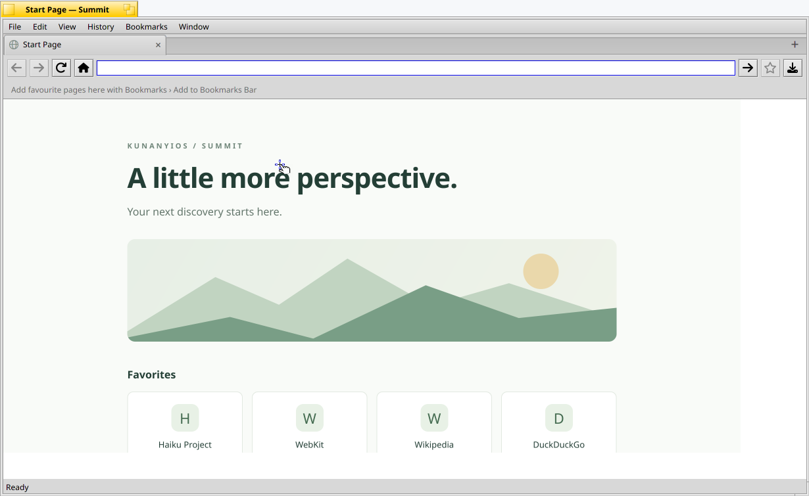

# Browser chrome: Home, bookmarks bar, History and Bookmarks tabs, favicons

(Multiple windows, context menus and the Haiku look came later; see
[browser-windows.md](browser-windows.md). The developer tools are in
[developer-tools.md](developer-tools.md).)

Added 26 September 2026. The sidebar (Start Page / Bookmarks / History
buttons and a list) is gone; each of its jobs moved somewhere else.

## What the user sees

- **Home button** (toolbar, after Back and Forward; also View › Home,
  Shift+Alt+H, and History › Home) opens the home page. Edit › Preferences…
  sets it: type an address, or use *Use Current Page* / *Use Start Page*.
  Empty means the built-in start page. The value is kept as typed and resolved
  like the address bar when Home is pressed, so a non-address searches.
- **Bookmarks bar** under the toolbar, as in Safari's Favorites bar. It shows
  bookmarks flagged for the bar, with their icons. Click opens in the current
  tab; middle-click or Alt-click opens a new tab; the secondary button offers
  Open, Open in New Tab, Remove from Bookmarks Bar and Delete Bookmark.
  Bookmarks that do not fit go in a » menu. View › Hide/Show Bookmarks Bar
  (Shift+Alt+B) or Preferences toggle it.
- **Star button** (toolbar) is filled when the current page is bookmarked. It
  offers Add to Bookmarks Bar / Add to Bookmarks, or Remove from Bookmarks Bar
  / Remove Bookmark. The Bookmarks menu has the same commands (Alt+D,
  Shift+Alt+D) and lists up to 40 bookmarks.
- **Bookmarks › Show All Bookmarks** (Alt+B) opens a *Bookmarks* tab: the bar's
  bookmarks, then the others, each with its icon, with a search field. Clicking
  one opens it in that same tab; Back returns to the list.
- **History › Show History** (Alt+Y) opens a *History* tab grouped by day —
  Today, Yesterday, then e.g. "Tuesday, 22 September 2026" — with each page's
  icon, address and time, and a search field. Entries saved before visits were
  timed are grouped under "Earlier". The History menu lists the 15 most recent
  pages and has Clear History….
- **Favicons** appear on tabs, the bookmarks bar and both built-in pages. A
  loading tab keeps its icon with a dot on its corner.

There is one History tab and one Bookmarks tab: the menu commands select an
open one instead of opening another. A built-in page is rewritten when it is
opened, reloaded, selected after something changed, or returned to with Back
or Forward. It does not reload itself while you are looking at it (that would
lose the scroll position and search text); Reload brings it up to date.

## Toolbar icons

The toolbar uses Font Awesome silhouettes converted to native Haiku vectors
(9 October 2026). All controls share a padded 20-point canvas, with individual
optical sizing. The vectors render at the actual display density and use the
current theme's text color, including private windows and disabled controls.
A filled gold star identifies a bookmarked page, an amber triangle identifies
a certificate warning, and Reader mode turns green when active. Native and
flat button appearances both retain pressed and hover feedback.

Sources, attribution and regeneration instructions are in
[artwork/README.md](../resources/artwork/README.md). No icon font is required.

As of 9 October 2026, both interface styles omit the Go button. Enter in the
address field still navigates. Downloads opens the folder without an error
dialog when Tracker reports `B_ALREADY_RUNNING`: that status means the existing
Tracker received the folder reference. Native checks in `bundle-b46l7ic6`
verified Enter navigation, the absent Go button and three repeated Downloads
clicks in each style (34 checks total).

## Address field type-ahead

Added 2 October 2026 for [issue #8](https://github.com/jmgasper/summit/issues/8),
working like Firefox's address bar:

- **Completion in the field.** Typing the start of a site you have visited or
  bookmarked completes it in the field: "pul" becomes "pul**setasmania.com/**",
  the completed part selected, so the next key replaces it if it differs and
  keeps it if it matches; Enter goes to the site. "www." is left out unless you
  type it, and a scheme you type limits completion to that scheme. Once the
  text reaches into a path, the next path segment is completed
  ("github.com/jm" → "github.com/jm**gasper/**"). Backspace removes the
  completion and keeps what you typed; completion only happens while typing
  forward at the end, never with spaces (that is a search).
- **The list under the field** shows what Enter will do (visit the completed
  site or the address typed, or search with the chosen engine), then matching
  pages from history and bookmarks — every typed word must appear in the page's
  address or title — with title, short address and site icon, and a search row.
  Up and Down move through it (the field shows the row's address; moving past
  the ends returns to what you typed), Enter or a click opens the row, Escape
  closes the list and a second Escape puts the page's address back. The list
  closes when the field loses the focus, the window moves or is deactivated.
- **Ranking.** Sites and pages are weighted by how often they were visited
  (history now counts visits, `visits` in `profile.json`) and how recently:
  ×100 within 4 days, ×70 within 2 weeks, ×50 within a month, ×30 within three
  months, ×10 after that. Bookmarks count as one recent visit. Sites whose name
  starts with the typed text rank above pages that only contain it.
- The logic is in `src/core/Suggest.{h,cpp}` (host-tested in
  `tests/CoreTests.cpp`); the list is `src/ui/AddressSuggestions.{h,cpp}`, a
  borderless window floating over the browser window that never takes the
  focus; `BrowserWindow::AddressModified()` drives both from the field's
  modification messages.

## How it works

- `src/core/Profile.*` — history entries carry `visited` (seconds since the
  epoch), bookmarks carry `bar`, and the profile has `homeURL` and
  `showBookmarksBar`. All are optional in `profile.json`, so older profiles
  load unchanged and older builds ignore them. `Visit` only records http(s)
  pages and says whether it did.
- `src/core/InternalPages.*` — day grouping (local calendar days, stepped back
  at noon so daylight saving cannot skip one) and the two pages' HTML. The pages
  are self-contained: icons are `data:` PNGs in a `<style>` block, one class per
  distinct icon; hrefs are only emitted for http, https and file URLs.
- `summit:history` and `summit:bookmarks` are real addresses (`ResolveAddress`),
  restored with the session like `summit:home`. The window writes them to
  `<profile>/Pages/{history,bookmarks}.html` and loads the file;
  `BrowserWindow::StoredURL` maps the file URL back, so the address bar stays
  empty and nothing reaches history.
- `src/core/Favicon.*` — `.ico` entry choice (closest to 32 px) and DIB
  decoding with the AND mask, area-averaged scaling to 16×16, a stored-deflate
  PNG encoder (no zlib), base64 and the cache key (the host). Other formats go
  through the Translation Kit in `src/ui/FaviconCache.*`, which keeps one PNG per
  host in `<profile>/Favicons/` and falls back between `www.host` and `host`.
- Engine: WebCore already collects `<link rel=icon>` candidates (and
  `/favicon.ico` when a page names none), but the Haiku port never attached an
  icon-loading client, so none were loaded. `IconLoadingClientHaiku` in
  `Source/WebKit/UIProcess/haiku/WebView.cpp` accepts the non-SVG favicon
  closest to 32 px (Haiku has no SVG translator) and posts
  `B_WEBKIT_ICON_LOADED` ('wico': `view`, `url`, `iconURL`, `mimeType`, `data`,
  at most 1 MiB) to the view's notification target. The engine fetches it with
  the page's own network session, cookies and cache.
- `summitctl --team ID sidebar` now hides the bookmarks bar so benchmark
  viewports stay full height (`hide-bookmarks-bar` is the same command).

## Tests

`build-host/summit_tests` covers the profile fields, address resolution, ICO
selection and decoding (1- and 32-bit, masks), scaling, PNG output, day
grouping (with `TZ=UTC`) and HTML escaping. A PNG from `EncodePNG` was also
checked with PIL.

On the workstation (bundle `bundle-14gx1mrh`, PGO engine with the icon client)
everything above was driven through VNC with `tools/bench/vnc-input.py`, which
can now use other buttons, hold clicks (Haiku menus ignore 100 ms clicks from
VNC) and type text. Two bugs were found and fixed that way: a History tab that
reloaded itself forever (its own load counted as a history change), and a
refresh that cancelled a click on a History entry.

## Not done

- No bookmark editing (rename, reorder, folders) beyond add/remove and
  bar membership; no drag and drop onto the bar.
- History keeps one entry per address (its latest visit), as before.
- SVG-only favicons are not shown.
- Menus list pages without icons.

## Installed

On 9 October 2026, the X399 desktop launcher
`/boot/home/Desktop/Summit-current.sh` and `/boot/home/summit/Summit-installed`
were updated to `bundle-b46l7ic6`, with the `SkiaCGMiPGO` engine and existing
private Mesa prefix `prefix-20261002`. Summit was restarted with its normal
profile; loaded engine libraries and helper executables were verified against
the new bundle. Installation evidence is in
`.vm/fixes-2026-10-09/install.log`. The five host test suites also pass.

The original 26 September browser UI rollout used `bundle-14gx1mrh`, with
`Summit-current.pre-browser-ui-20260926.sh` as its launcher backup.
