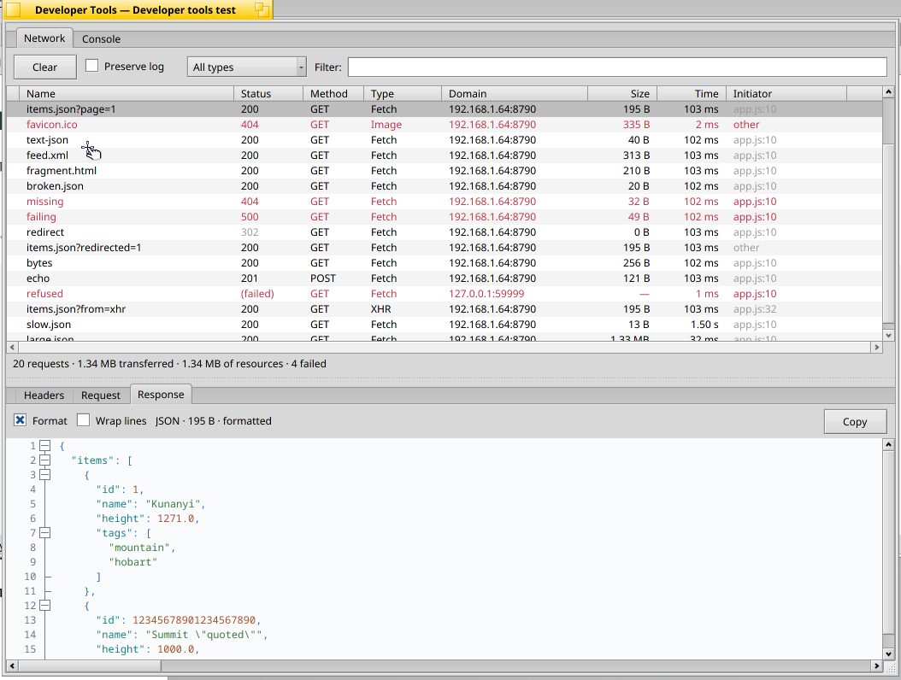
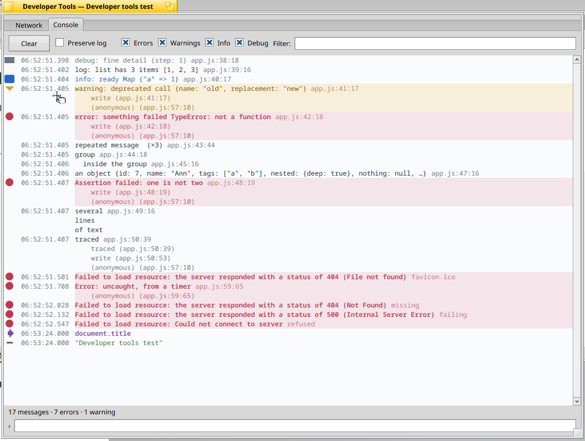

# Developer tools: the Network tab and the Console

Added 30 September 2026. This is the first pass: what a page asks of the
network, and what it writes to its console. Elements, sources, a debugger and
storage are not part of it (see [Not done](#not-done)).



## What the user sees

**View › Developer Tools** (Shift+Alt+I, or *Developer Tools* at the end of a
page's context menu) opens a window for the current tab, titled with the
page's title. Each tab has its own; the command brings an open one forward.
The window closes with its tab.

The tools record from the moment they open. A page that has already loaded
shows nothing until it asks for something again; reload it to see everything
it loads.

### Network

One row for each request: name (the last part of the address), status,
method, type, domain, size, time and what started it (`app.js:10`, or the
document). A redirect is a row of its own, in grey, followed by the request
it led to. Failed requests and answers of 400 and above are red. The columns
sort and resize; the line under the list counts the requests and their bytes.

Above the list: **Clear**, **Preserve log**, a menu of types (all, fetch and
XHR, documents, style sheets, scripts, images, fonts, other) and a filter on
the address.

Selecting a request shows three tabs below the list:

- **Headers**: address, method, status, type, remote address, protocol,
  size, when and how long; then the response's headers and the request's
  (as they went over the network, so with the cookies and the user agent).
- **Request**: the body that was sent, if any.
- **Response**: what the server answered.

Bodies are shown in the fixed font and coloured by what they are. **JSON,
XML and HTML are laid out for reading** while *Format* is ticked; untick it to
see the bytes as they came. **Copy** puts the text on the clipboard as it is
shown, so formatted if it is formatted. A body is recognised by its
`Content-Type` and, where that says little (`text/plain`,
`application/octet-stream`, nothing), by its content. JSON that is not valid
is shown as received, and says so. Pictures are shown as pictures; other
binary data as a hexadecimal dump. *Wrap lines* and the secondary button's
menu (Copy, Copy All, Select All) work on every text.

### Console

The page's messages in the fixed font, **coloured by severity**: errors in
bold red on a red tint, warnings in amber on a yellow tint, information in
blue, debug messages in grey, `console.log()` in the text colour. Each has a
mark of its own shape and colour in the margin, its time beside it and its
place in the page's sources (`app.js:41:17`) after it. Errors, warnings,
`console.trace()` and failed assertions show their call stack. Objects and
arrays are shown by their preview (`{id: 7, name: "Ann", …}`), `%s`, `%d`,
`%o` and the rest are substituted, a repeated message is counted (`×3`) and
the members of a `console.group()` are indented.

Above the log: **Clear**, **Preserve log**, a check box for each level to
show (**Errors**, **Warnings**, **Info**, which is `console.info()` and
`console.log()`, and **Debug**) and a filter on the text. The line under the
log counts the messages, the errors and warnings among them, and those the
levels or the filter hide.

The field at the bottom runs JavaScript in the page; Up and Down bring back
earlier lines. What was typed and what it gave are shown in the log whatever
levels are ticked.



### Preserve log

Without it, a navigation of the page empties the list of requests and the
console, so that they show the page that is there. The new page's own
document is the first row, not the last of the old.

With it, nothing is removed: the requests of the pages before stay in the
list, and the console marks where the page changed (*Navigated to …*). The
page is also told to keep the bodies of what it loaded, so that a response of
an earlier page can still be read, as long as the navigation stayed in the
same process. `console.clear()` does not clear a console that is kept.

The two check boxes are independent, and **Clear** empties its own panel at
any time.

## How it works

```
page (WebProcess)          UIProcess                          browser
 Network, Console,   -->   WebPageInspectorController   -->   BWebKitInspectorSession
 Page, Runtime agents      (target router)                     queue, one notification
                                                                    |
                                        DevToolsWindow's thread:  devtools::Session
                                                                    |
                                                          NetworkPanel, ConsolePanel
```

- **Engine.** Nothing new is measured: the tools listen to WebKit's own Web
  Inspector protocol. `BWebKitInspectorSession`
  (`Source/WebKit/UIProcess/API/haiku/WebKitInspector.{h,cpp}`) connects a
  frontend channel to the page's `WebPageInspectorController`, the way a
  remote Web Inspector does. The page's messages are queued for the host and
  announced by one `B_WEBKIT_INSPECTOR_MESSAGES` per batch, because a busy
  page sends thousands and a window's port holds two hundred. Connecting
  turns on the *developer extras* of the page's preferences, without which
  console messages never leave the web process; the last session to end
  turns them off again. With no tools open the engine does nothing it did
  not do before.
- **Model.** `src/core/DevTools.{h,cpp}` reads the protocol into a list of
  requests and a list of console entries, and says what changed. It enables
  `Page`, `Network` and `Console` in every target, which is the page's
  process: a navigation to another site starts in a new process, whose target
  is paused (`Target.setPauseOnStart`) until its requests are being recorded,
  so the new page's document is not missed. Bodies come from
  `Network.getResponseBody`: at once for documents and for what scripts fetch
  (up to 2 MiB each, since those are what is read and the page forgets them
  when it moves on), and when they are selected for everything else. At most
  128 MiB of bodies, 5000 requests and 10000 console entries are kept.
- **Formatting.** `src/core/DevToolsFormat.{h,cpp}`. JSON is validated with
  nlohmann's parser and then re-indented token by token, so that no number or
  escape is rewritten (`12345678901234567890`, `1.0` and `1e3` stay as the
  server wrote them, which parsing and printing again would not guarantee).
  XML and HTML are tokenised and written one element a line; HTML knows void
  elements, end tags that may be omitted, inline elements, and leaves `pre`
  and `textarea` alone and the text of `script` and `style` as it is, moved
  to the element's indentation.
- **Windows.** `src/ui/DevToolsWindow.*`, `DevToolsNetwork.cpp`,
  `DevToolsConsole.cpp` and `SourceView.*`. The window has its own thread, on
  which the model is fed and shown; the browser window only opens and closes
  it.

### What is shared with Kiri

The owner asked for formatting and parsing to follow
[Kiri](https://github.com/jmgasper/kiri), the editor, where that is possible:

| | Kiri | Summit's tools |
| --- | --- | --- |
| JSON parsing | vendored nlohmann/json | the same header (`vendor/nlohmann`), for the protocol and for validating bodies |
| Showing sources | Scintilla with Lexilla lexers (`src/ui/Editor.cpp`) | the same: `SourceView` sets lexers, keywords, folding and fonts as `Editor::SetLanguage()` and `Editor::ApplyTheme()` do |
| Colours | its themes (`src/core/ColorTheme.cpp`) | the palettes of its *Daylight* and *Obsidian* themes, chosen by whether the system's documents are light or dark; the same roles colour the same styles |
| Formatting | runs Prettier on the file | its own formatters |

Formatting is the exception. Kiri formats by running Prettier, which needs
Node and a saved file, and is not installed on the workstation; a browser
cannot ask for that to read a response. Should Kiri gain formatters of its
own, these are small enough to follow them.

Scintilla and Lexilla are the system's packages (`scintilla`, `lexilla`,
with their `_devel` packages to build). `tools/build-modern-browser.py`
copies `libscintilla.so` and `liblexilla.so` into the bundle's `lib` and
their licence into `licenses/Scintilla`, so a bundle runs where the packages
are not installed. `BColumnListView` is the system's static
`libcolumnlistview.a`.

## Tests

- `build-host/summit_devtools_tests` (225 checks; also `make check` on
  Haiku): the formatters, body detection, base64 and hexadecimal output, and
  the model fed with protocol messages: requests, redirects, failures,
  bodies, the memory cache, navigation in the same process and to another,
  kept logs, console levels, previews, format substitutions, stacks, groups,
  repeats, expressions, the limits, and input that is not the protocol.
- `tools/bench/devtools/server.py` serves a page that asks for every kind of
  thing the Network tab shows and writes every kind of message the Console
  shows, and a second page to navigate to.
- `summitctl --team ID devtools [network|console]` opens the tools of the
  current tab. `summitctl --team ID devtools-do ACTION [ARGUMENT]` drives an
  open window as its controls do and prints what it shows as JSON (the
  requests and entries of the model, the rows and text on screen, the body
  as shown). It is refused unless Summit was started with
  `SUMMIT_ENABLE_INPUT_SYNTHESIS=1`, because `evaluate` runs script in the
  page. Actions: `state`, `panel`, `select ADDRESS-PART`, `detail
  headers|request|response`, `format on|off`, `wrap on|off`, `copy`,
  `clear-network`, `preserve-network on|off`, `filter-network TEXT`, `types
  N`, `clear-console`, `preserve-console on|off`, `levels errors,warnings`,
  `filter-console TEXT`, `evaluate EXPRESSION`.
- `SUMMIT_DEVTOOLS_TRACE=1` also writes every finished request, body and
  console message to standard error.

## Verified on the workstation

With `bundle-aq7v8_rg` (the `SkiaCGMiPGO` engine with the inspector session)
from a private copy and profile, against `tools/bench/devtools/server.py`
and two real sites, on 30 September 2026:

| | |
| --- | --- |
| The menu | View › Developer Tools clicked with the mouse over VNC opens the window; a second command brings it forward |
| Requests | the test page's 20: document, style sheet, script, picture, fetches, an XHR, a POST (201), a redirect (302, then the 200 it led to), 404, 500, and a connection refused shown as *(failed)* |
| Headers | the request's as sent (Cookie, User-Agent, Referer...), the response's (Set-Cookie...), remote address, protocol, size and time |
| Bodies | JSON, JSON served as `text/plain`, RSS and HTML formatted; JSON that is not valid shown as received, with a note; a 1.33 MB JSON answer formatted to 2.6 MB of text; the POST's own body under Request; a PNG as a picture; 256 bytes as a hexadecimal dump |
| Copy | the clipboard (`clipboard -p`) holds the formatted text with Format ticked and the text as received without |
| Console | all five levels in their colours, stacks, previews, substitutions, a repeat counted ×3, a group, a failed assertion, an error thrown from a timer, the engine's own messages for failed loads |
| Levels and filter | each combination shows what it should and the count line says how many are hidden |
| Expressions | values, objects, a DOM node, a promise, a reference error and a syntax error |
| Navigation | without *Preserve log* the next page's 4 requests and 4 messages replace the first page's; with it, 23 requests and both pages' messages stay, with *Navigated to …* between them, and an earlier page's response can still be read |
| Another process | from the test site to haiku-os.org (36 requests) and to The Guardian (about 600 requests from 190 hosts, 19 messages): the new page's document is the first row |
| Windows | a tools window for each of two tabs; closing a tab closes its window; quitting with tools open leaves no process and no crash report |
| Load | 30000 `console.log()` calls from one expression are read in under 3 s and the newest 10000 kept |

## Installed

The workstation's desktop launcher `/boot/home/Desktop/Summit-current.sh`
points at `bundle-aq7v8_rg` since 06:53 on 30 September 2026 (Mesa
`prefix-20260930`, as before; the launcher it replaced is
`/boot/home/summit/launcher-backups/Summit-current.pre-20260930-0653.sh`).
A browser that was already running keeps the build it started with until it
is started again.

## Not done

- Messages and requests from before the tools were opened. The engine keeps
  console messages for an inspector only while developer extras are on, and
  they are on only while tools are open, so that pages nobody inspects pay
  nothing.
- Elements, sources and the debugger, storage, timelines. The session
  carries the whole protocol, so they need panels, not engine work.
- Web sockets' frames, request timing broken down (DNS, connect, TLS),
  throttling, blocking and replaying requests, copy as cURL, HAR export.
- Expanding an object in the console: previews are shown, not trees.
- Docking the tools in the browser window.
- The bodies of an earlier page after a navigation that changed process, for
  anything that had not been fetched by then.
