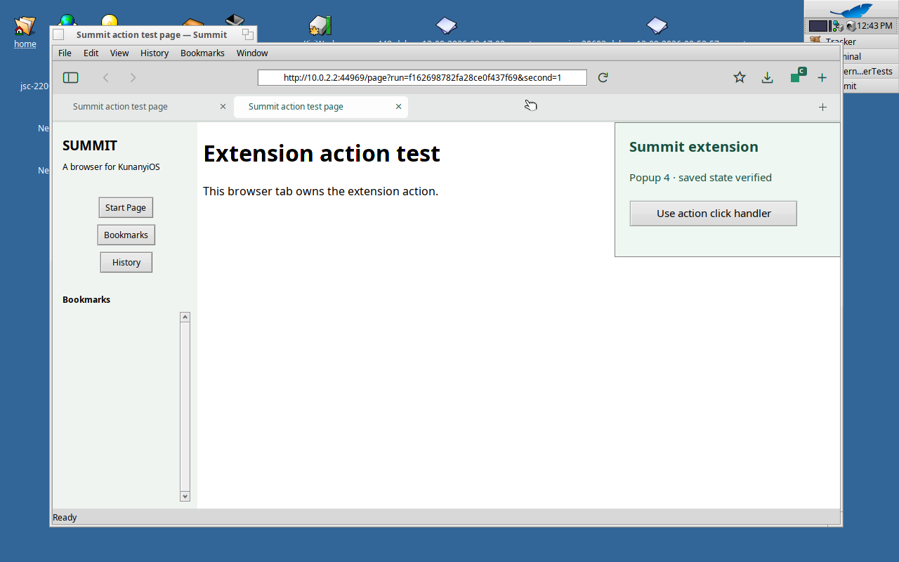
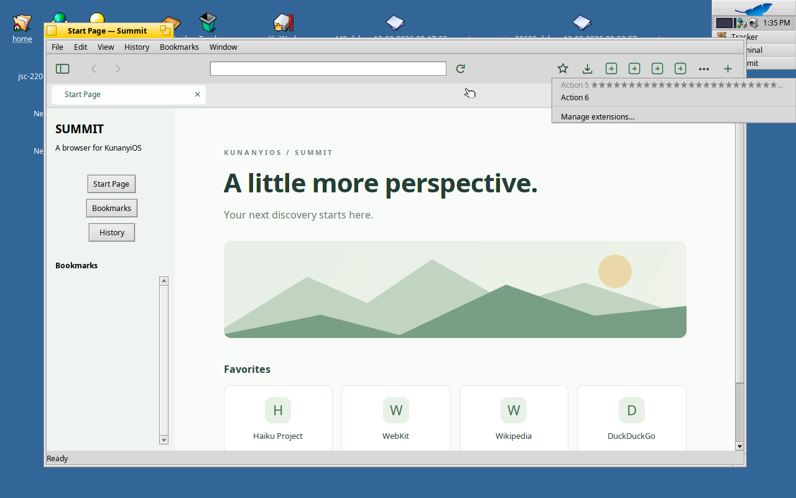

# Native toolbar actions and extension popups

The modern extension-enabled Summit browser now displays live extension action
buttons. A button uses the extension's title, decoded icon, badge and enabled
state for the active tab. Four buttons fit beside the address bar; additional
actions appear in a native overflow menu. Keyboard activation uses the native
button control. The menu includes Manage extensions, skips disabled actions,
and truncates long labels to preserve a usable width. Its six-extension native
test covers keyboard activation, rapid dismissal and shutdown with the menu open.

Clicking an action with a popup opens its actual extension HTML in a native
floating window. The page has the extension's origin, CSP, privileged APIs and
storage. An action without a popup dispatches its real `onClicked` event with
the current browser tab. Popups close when their action becomes invalid, the
active tab changes, the extension unloads, or the browser closes. The popup
currently anchors below the toolbar at the content's right edge; anchoring
directly to the individual button remains work.

## Public SDK and lifetime

`BWebKitContext::SetExtensionActionListener` registers a local application
listener for `B_WEBKIT_EXTENSION_ACTIONS_CHANGED`. Notifications invalidate
the displayed state after loading, unloading, or live action changes. Summit
also queries after native browser registration, focus and tab selection changes.
The listener is cleared during shutdown. Each context observer holds a weak
registry reference and is removed when that context unloads.

`GetExtensionActions(window, reply, identifier)` reads real per-tab action
objects on WebKit's main loop. Its reply contains title/name/badge, enabled and
popup state, the current extension load and active page IDs, and an optional
16 × 16 unpremultiplied BGRA icon. Failed replies supply no partial action list.
Summit ignores superseded query replies and disables controls while refreshing.
Untrusted extension labels are sanitized using the manager's existing rules.
Displayed snapshot revisions change only when action data changes, so a
focus-only refresh does not invalidate an otherwise unchanged open menu.
Changed action data and window closure cancel native menu tracking on its
own looper. The cancellation flag remains alive until the asynchronous menu
is destroyed.

`ActivateExtensionAction` requires trusted native input and the load/page IDs
from the displayed snapshot. The engine checks the current loaded context,
registered and focused owning window, active page, tab access and current
enabled state before dispatching the normal action user gesture. Summit also
rejects outdated UI snapshots and clicks during window closure. An accepted
receipt confirms dispatch; it does not claim that asynchronous popup loading
has completed. The browser's existing read-only state diagnostics include the
displayed action snapshot and the last activation receipt ID/error for native
integration testing. Negative tests inspect the engine's actual cancellation
receipt instead of assuming every refresh changes the displayed revision.

## Native evidence

Engine patch:
`063c724e002819e42a378056225eced55802f309254caf6640bed79c7534469e`.
The complete feature-enabled native engine compiles and links. The initial
build's final log is `.vm/modern-extensions-action-sdk-build.log`; its original
tool exit receipt was lost during context compaction. A subsequent native
`ninja -n all` returns zero with no work pending, and the bundled engine runs
the actual tests below. Browser bundle: `bundle-p214ja9w`.

The verified bundle is available at `artifacts/modern-browser/bundle-p214ja9w/`
with matching frozen application inputs and WebKit sources. Copy provenance
SHA-256: `fe620c5e42a9f5c783f3b62ec40c3854a4b99eaec38001b7acf3d9a01e2ba056`.
Engine source archive SHA-256:
`40b83599ce48235f5dc8b30dc2d743290081140a16cb3c22c976fafa64eae62e`.
The native report, binary/launcher digests and before/after source/support
fingerprints match. Copy log: `.vm/modern-browser-action-toolbar-bundle-copy.log`.

```sh
python3 tools/test-modern-extension-startup.py --manager --actions \
  --bundle /boot/home/summit/build-modern-browser/bundle-p214ja9w
python3 tools/test-modern-extension-startup.py --manager --actions --chrome-key --watch \
  --bundle /boot/home/summit/build-modern-browser/bundle-p214ja9w
```

The Gecko-ID run passes **202 native checks** in
`.vm/modern-extension-actions-526c7b8cb8d3ee33c9385504/result.json`.
The extended Chrome-key run passes **217 native checks** (168 installation,
15 quit with popup open, 22 removal, 12 after removal), plus **29 native identity
checks**, in
`.vm/modern-extension-actions-f162698782fa28ce0f437f69/result.json`.
All browser and helper groups exit normally, without forced cleanup or new
native crash events. Frozen bundle, staged inputs and host test sources remain
unchanged. The Chrome-key run uses four separate Summit processes and reports
the independently expected ID `melddjfinppjdikinhbgehiennejpfhp`.

The fixture is installed through the actual native file picker and permission
review. Real background JavaScript changes the title and badge. Tests inspect
the decoded icon bytes, open and close popup documents, click a DOM button
through native pointer input, and check actual HTTP reports from extension
JavaScript. Popup storage survives page destruction and browser restarts.
The action-click event carries the real selected tab and URL. Tab-specific
title/disabled overrides remain isolated. Deliberate old-page and old-load
activations are rejected by the engine. Removal destroys an open popup, and
application shutdown with a popup open drains normally. Optional tab permission
remains ungranted throughout installation and restarts.



`--watch` pauses briefly on each popup for VNC observation. The test saves a
separate demonstration profile after a clean browser exit and before removal
tests; this does not change the profile used to verify removal.

## Overflow runtime verification

Browser bundle `bundle-7ve4k1a6` contains the menu lifetime, keyboard and
snapshot-revision fixes, with the same engine patch as the toolbar bundle.

```sh
python3 tools/test-modern-extension-overflow.py \
  --bundle /boot/home/summit/build-modern-browser/bundle-7ve4k1a6
python3 tools/test-modern-extension-startup.py --manager --actions --chrome-key --watch \
  --bundle /boot/home/summit/build-modern-browser/bundle-7ve4k1a6
```

The overflow fixture passes **169 native checks** in
`.vm/modern-extension-overflow-ac4790e3620d51484595f780/result.json`.
It installs six independent Gecko-ID extensions through the actual picker and
consent UI. Four actions remain on the toolbar. A disabled fifth action with a
long Unicode title stays bounded in the menu, and the enabled sixth action runs
its own popup JavaScript without changing the fifth extension. Manage extensions
is keyboard-accessible even when the only overflow action is disabled.

Timing assertions prove that the engine accepts Enter, and that Escape finishes,
before the native menu's opening-click interval ends. Dismissal remains effective
after that interval and does not activate an extension. Quitting with an open
menu exits normally. The harness locates menu hosts through the native looper
list because Haiku excludes menu windows from ordinary window enumeration.

The full action regression on this bundle passes **217 native UI checks plus
29 identity checks** in
`.vm/modern-extension-actions-af2da144d89229bf2ce91813/result.json`.
All five browser processes across these two tests exit zero, their process groups
drain without forced cleanup, and no new native crash events appear. Frozen
bundles, staged inputs and host test sources remain unchanged. Earlier failed
overflow results remain preserved; they are superseded only for the paths these
tests cover.

The complete artifact is `artifacts/modern-browser/bundle-7ve4k1a6/`.
Copy provenance SHA-256:
`1e64738d2b33617b4546e3762330bccc6de216b9efedaa1d4f0af4765cc87992`.
Its engine archive retains SHA-256
`40b83599ce48235f5dc8b30dc2d743290081140a16cb3c22c976fafa64eae62e`.
The copy records host commit `954815f`, matching native and host reports,
binary/launcher digests and unchanged source/support fingerprints. Copy log:
`.vm/modern-browser-overflow-bundle-copy.log`.



## Remaining coverage and compatibility

These fixtures prove the listed action paths, not arbitrary Chrome, Firefox or
Safari extension compatibility. MV3/service workers, remaining action APIs,
badge colors, dynamic icon changes, direct button anchoring, overflow pointer input,
private contexts, multi-window behavior and a real extension corpus need more
implementation or runtime coverage. Active-tab permission transitions, popup
navigation/CSP rejection, modal dialogs, renderer failure and permission
revocation also need dedicated integrated tests. Existing native host-only
tests cover additional window behavior separately.

The three portable CTest suites also pass. An isolated native system-WebKit
Makefile build compiles and links the legacy app and passes its 38 core checks
(`.vm/legacy-action-toolbar-build-result.json`). That build does not claim
extension runtime support.
